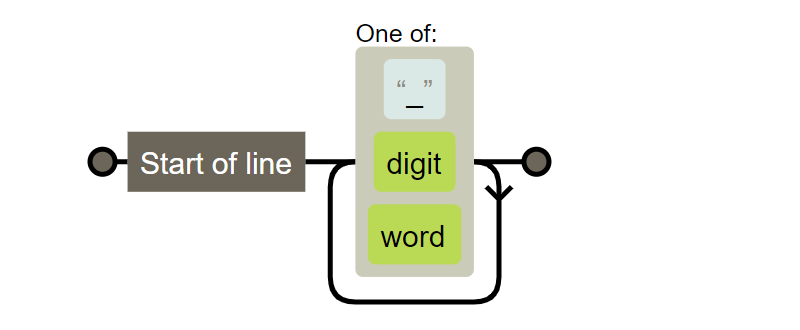
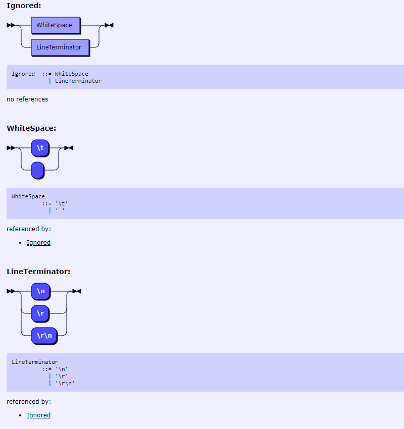

牙医教你 450 行代码自制编程语言 - 3, 实现 Lexer 上篇.md
----------------------------------------------------

@version    20210104:1  
@author     karminski <work.karminski@outlook.com>


上一篇  [牙医教你 450 行代码自制编程语言 - 2, 两个魔法就可以实现永动机](https://zhuanlan.zhihu.com/p/341532964), 简单讲了构成 Lexer & Parser 的元素. 本期我们就要开始实现 Lexer了.

本教程的所有代码都可以在 [https://github.com/karminski/pineapple](https://github.com/karminski/pineapple) 找到.  

另外, [KevinXuxuxu](https://github.com/KevinXuxuxu) 同学看了我的 demo 后, 还实现了一个 Python 版本的, 地址在这里: [https://github.com/KevinXuxuxu/pineapple-py](https://github.com/KevinXuxuxu/pineapple-py)  

再次推荐这本书, 本教程就是类似这本书的简化版本, 想要仔细学习的话可以考虑看原作:  

# 实现 Lexer 数据结构

我们直接来看 Lexer 的结构和 New 函数:

```go
type Lexer struct {
    sourceCode          string 
    lineNum             int    
    nextToken           string 
    nextTokenType       int 
    nextTokenLineNum    int
}

func NewLexer(sourceCode string) *Lexer {
    return &Lexer{sourceCode, 1, "", 0, 0} // start at line 1 in default.
}
```

其中, ```sourceCode``` 就是我们的源代码, 直接读取源代码文件并输入进来就可以了.   

然后 ```lineNum``` 用于记录当前执行到的代码的行号.  

```nextToken``` 即下一个 Token 的内容, ```nextTokenType``` 则是下一个 Token 的类型, 对应我们定义的 Token 类型常量. ```nextTokenLineNum``` 是下一个 Token 的行号.  

为什么要这么设计? 其实本质上 Lexer 是一个状态机, 他只要能处理**当前状态**和**跳到下一个状态**, 就可以一直工作下去了. 我们接下来演示它是如何工作的.  


# 看看是什么Token?

我们要实现的一个最重要的函数就是 **看看当前字符是什么Token**, 它的功能是查看当前字符, 然后识别是什么 Token, 实现是这样的:  

```go
func (lexer *Lexer) MatchToken() (lineNum int, tokenType int, token string) {
    // check token
    switch lexer.sourceCode[0] {
    case '$' :
        lexer.skipSourceCode(1)
        return lexer.lineNum, TOKEN_VAR_PREFIX, "$"
    case '(' :
        lexer.skipSourceCode(1)
        return lexer.lineNum, TOKEN_LEFT_PAREN, "("
    case ')' :
        lexer.skipSourceCode(1)
        return lexer.lineNum, TOKEN_RIGHT_PAREN, ")"
    case '=' :
        lexer.skipSourceCode(1)
        return lexer.lineNum, TOKEN_EQUAL, "="
    case '"' :
        if lexer.nextSourceCodeIs("\"\"") {
            lexer.skipSourceCode(2)
            return lexer.lineNum, TOKEN_DUOQUOTE, "\"\""
        }
        lexer.skipSourceCode(1)
        return lexer.lineNum, TOKEN_QUOTE, "\""
    }

    // unexpected symbol
    err := fmt.Sprintf("MatchToken(): unexpected symbol near '%q'.", lexer.sourceCode[0])
    panic(err)
    return 
}
```

首先我们用 ```switch lexer.sourceCode[0] {``` 来实现取出当前字符, 然后用 ```case '$' :``` 这样的匹配来匹配 Token.  

如果命中, 则返回当前行号, Token 类型, 和命中的字符, 即 ```return lexer.lineNum, TOKEN_VAR_PREFIX, "$"```.   

注意中间还有一行 ```lexer.skipSourceCode(1)```, 这个函数用来跳过指定长度的字符. 我们匹配完毕, 当然要跳过当前的 Token,  然后就可以匹配下一个了. 

```skipSourceCode()``` 的实现也很简单, 是这样的:  

```go
func (lexer *Lexer) skipSourceCode(n int) {
    lexer.sourceCode = lexer.sourceCode[n:]
}
```

用了 Go 语言的 Slice 切片操作的小技巧.  

# 那么多字符 Token 怎么办?

但是, 这只能匹配单个字符的 Token, 多个字符的 Token 该怎么办呢? 比如 ```Name``` Token, 其实可以这样:  

```go
...
// check multiple character token
if lexer.sourceCode[0] == '_' || isLetter(lexer.sourceCode[0]) {
    token := lexer.scanName()
    if tokenType, isMatch := keywords[token]; isMatch {
        return lexer.lineNum, tokenType, token
    } else {
        return lexer.lineNum, TOKEN_NAME, token
    }
}
...

func isLetter(c byte) bool {
    return c >= 'a' && c <= 'z' || c >= 'A' && c <= 'Z'
}
```

我们判断如果是下划线 ```lexer.sourceCode[0] == '_'``` 或字母开头的 ```isLetter(lexer.sourceCode[0])```, 我们就运行 ```token := lexer.scanName()``` 把 Name 扫描出来.  

```isLetter()``` 实现也很简单, 直接判断字符是否在大小写字符范围就可以了.  

那么, 重要的 ```scanName()``` 是怎么实现的呢? 答案是正则表达式.  

```go
var regexName = regexp.MustCompile(`^[_\d\w]+`)

func (lexer *Lexer) scanName() string {
    return lexer.scan(regexName)
}

func (lexer *Lexer) scan(regexp *regexp.Regexp) string {
    if token := regexp.FindString(lexer.sourceCode); token != "" {
        lexer.skipSourceCode(len(token))
        return token
    }
    panic("unreachable!")
    return ""
}
```

我们的正则表达式是```^[_\d\w]+```:  



可以看到必须是行的开始, 然后是下划线 ```_``` , 数字 ```\d``` , 或者字符 ```\w``` 的循环 ( ```+``` 代表一个或多个).  

由于我们规定了 ```Name ::= [_A-Za-z][_0-9A-Za-z]*``` 只能是下划线或大小写字母开头, 我们在之前的 ```if lexer.sourceCode[0] == '_' || isLetter(lexer.sourceCode[0]) {``` 已经定义好了这一点. 所以不会出现正则扫描到数字开头的 Token 的情况.  

# 多字符的实现方法 2

```go
...
case '"' :
    if lexer.nextSourceCodeIs("\"\"") {
        lexer.skipSourceCode(2)
        return lexer.lineNum, TOKEN_DUOQUOTE, "\"\""
    }
    lexer.skipSourceCode(1)
    return lexer.lineNum, TOKEN_QUOTE, "\""
...

func (lexer *Lexer) nextSourceCodeIs(s string) bool {
    return strings.HasPrefix(lexer.sourceCode, s)
}
```

我们这里还演示了第二种判断多字符的方式, ```nextSourceCodeIs()``` 利用 ```strings``` 库的 ```strings.HasPrefix()``` 方法扫描了空字符串 (两个双引号 ```""```) 的情况.  

这种判断方式比正则表达式性能要好一些, 适合于确定性的 Token, 比如例子中扫描的就是两个双引号组成的代表空字符串的 Token. 

# 多字符的实现方法 3

那么不确定长度的 Token 怎么办? 就比如 ```String ::= '"' StringCharacter '"' ``` 这种情况, 一大长串用双引号包裹的字符串该怎么办? 我们又实现了这样一个函数:    

```go
func (lexer *Lexer) scanBeforeToken(token string) string {
    s := strings.Split(lexer.sourceCode, token)
    if len(s) < 2 {
        panic("unreachable!")
        return ""
    }
    lexer.skipSourceCode(len(s[0]))
    return s[0]
}
```
我们用了 ```strings.Split()``` 方法, 当检测到目标标记后, 就把字符串分割开.  

比如 ```AAAA"BBBBBCCCC``` 用```"```分割, 就会被分成 ```AAAA``` 和 ```BBBBBCCCC```. 然后我们返回我们要的第一个就行了. 当然, 也可以逐个字符扫描, 直到检测到目标就停止, 这样性能会更好些, 感兴趣的同学可以改写下. 我这里犯懒了所以直接拍脑袋写了这个.  

# 还有其他情况吗? 

有的, 我们代码要有空格和换行的, 因此我们还需要一个 ```Ignored``` Token. 它的 EBNF 定义是这样的:  

```ebnf
Ignored        ::= WhiteSpace | LineTerminator 
WhiteSpace     ::= '\t' | ' ' /* ASCII: \t | Space, Horizontal Tab (U+0009), Space (U+0020) */
LineTerminator ::= '\n' | '\r' | '\r\n'   /* ASCII: \n | \r\n | \r, New Line (U+000A) | Carriage Return (U+000D) [Lookahead != New Line (U+000A)] | Carriage Return (U+000D)New Line (U+000A) */
```



简单来讲, 就是 tab, 空格, 和 换行 (```'\n' | '\r' | '\r\n'```) 都是 Ignored Token.  

那么, 我们来这样检测 Ignored Token:  

```go
...
// check ignored
if lexer.isIgnored() {
    return lexer.lineNum, TOKEN_IGNORED, "Ignored"
}
...

func (lexer *Lexer) isIgnored() bool {
    isIgnored := false
    // target pattern
    isNewLine := func(c byte) bool {
        return c == '\r' || c == '\n'
    }
    isWhiteSpace := func(c byte) bool {
        switch c {
        case '\t', '\n', '\v', '\f', '\r', ' ':
            return true
        }
        return false
    }
    // matching
    for len(lexer.sourceCode) > 0 {
        if lexer.nextSourceCodeIs("\r\n") || lexer.nextSourceCodeIs("\n\r") {
            lexer.skipSourceCode(2)
            lexer.lineNum += 1
            isIgnored = true
        } else if isNewLine(lexer.sourceCode[0]) {
            lexer.skipSourceCode(1)
            lexer.lineNum += 1
            isIgnored = true
        } else if isWhiteSpace(lexer.sourceCode[0]) {
            lexer.skipSourceCode(1)
            isIgnored = true
        } else {
            break
        } 
    }
    return isIgnored
}

```

还是简单的字符匹配, 然后跳过即可. 我这个实现判断了 Ignored Token, 顺便还跳过了一些其他的不需要的空白字符.  

好了, 本期内容有些长, 大家可能要多消化一下, 而且本期内容是最难的, 下期开始就会变得特别简单了. 敬请期待.  

